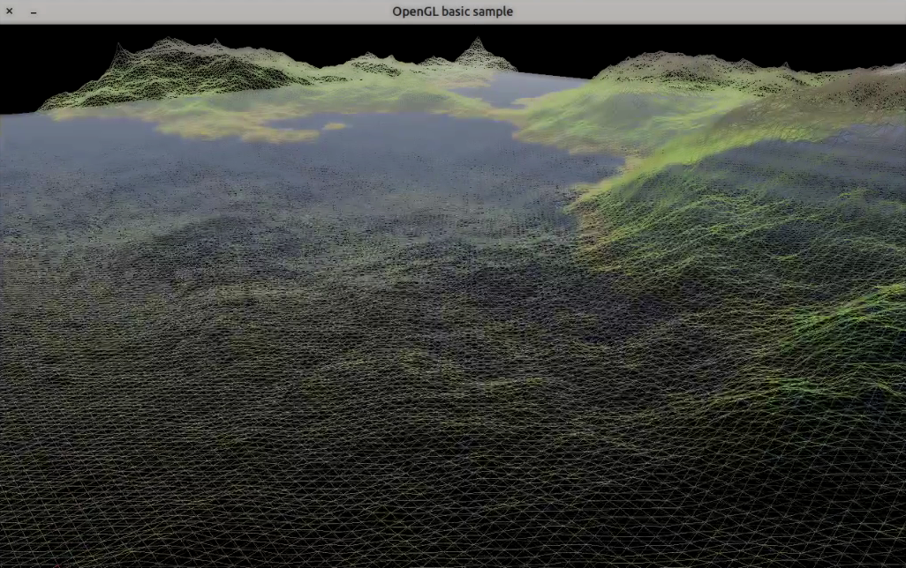

# Procedural Landscape

The most challenging and interesting assignment for MMXVII Computer Graphics classes.
See [task statement](./doc/task.pdf) for more details.



## Prerequisites

```sh
apt install libglfw3-dev libepoxy-dev libjsoncpp-dev libgtk-3-dev libx11-dev libsoil-dev libglm-dev
```

## Build instructions

```sh
cmake CMakeLists.txt -G 'Unix Makefiles'
make
```

This will create a bunch of files in the root of a project.
(yes ideally they should have been aggregated in a neat `build` dir or so)

Run with `./main`.

## Controls

```
LMB to capture/release mouse cursor
SPACEBAR to alternate between shaded wireframe and fill display modes
t to switch to texture visualization
f to enable fog
2 to activate normals view
ESC to exit
```
